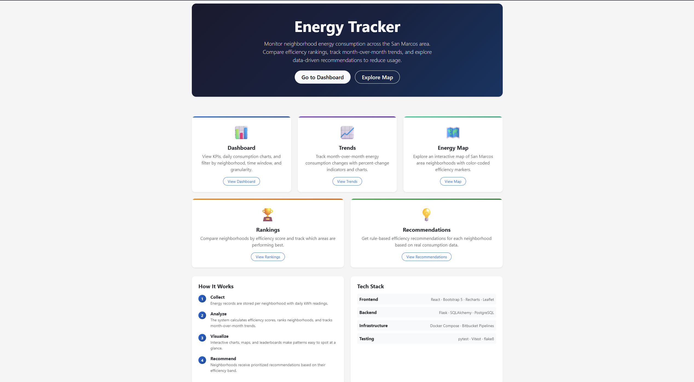
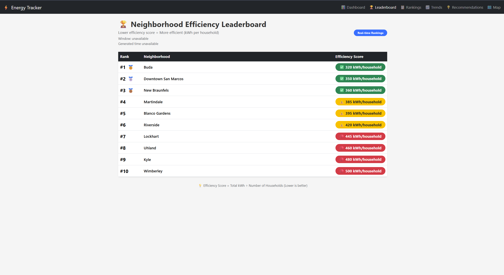
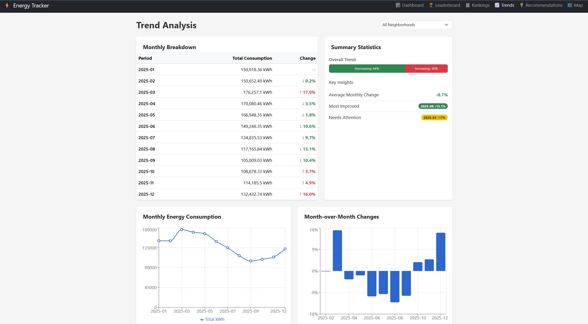
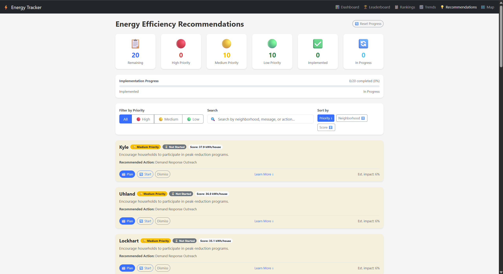
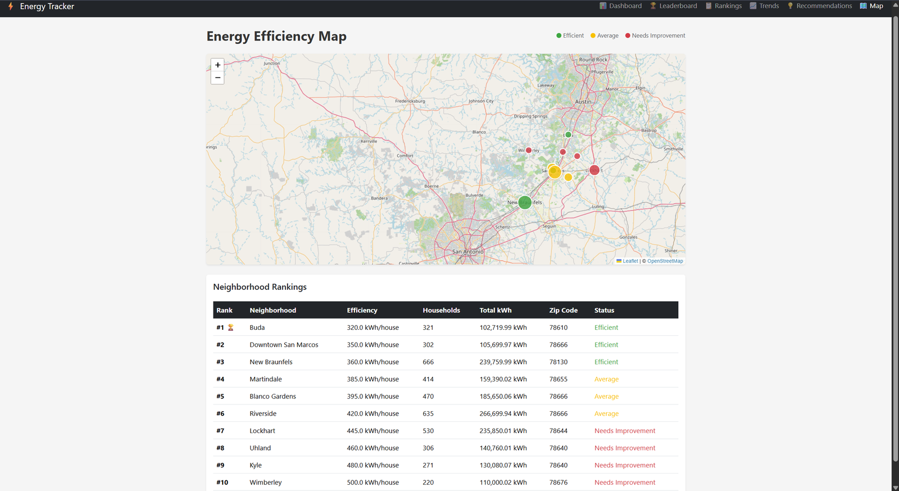
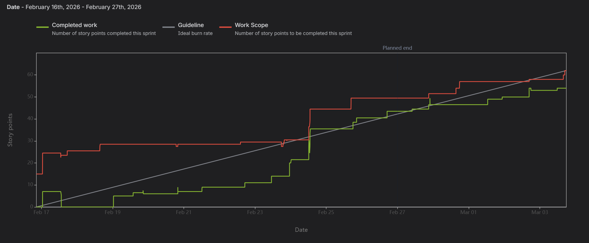
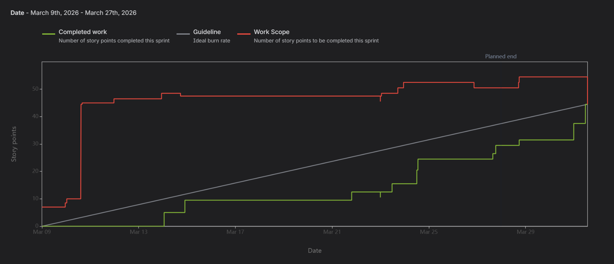
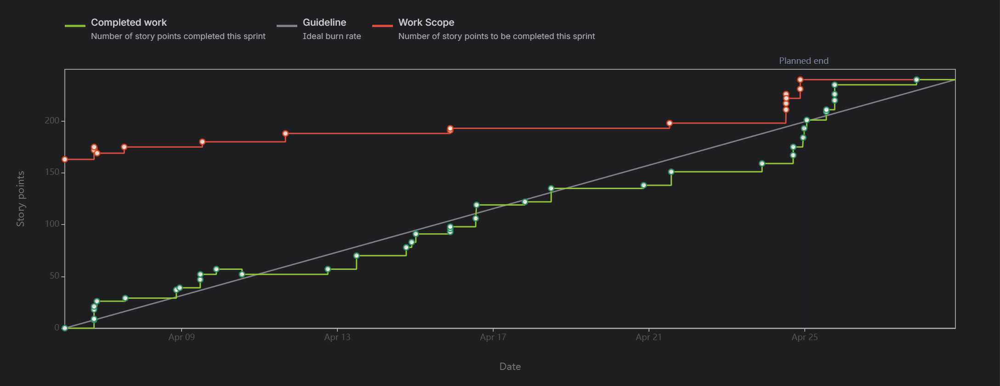

# Energy Tracker


A full-stack web dashboard that turns raw neighborhood-level electricity consumption data into efficiency rankings, month-over-month trend analysis, an interactive map, and rule-based sustainability recommendations. Built by a 5-person team over a 3-sprint agile cycle for CS3398 at Texas State University.

**[Live Demo](https://energytracker-frontend.onrender.com)** — hosted on Render's free tier, so the backend may take 30-50s to wake up on the first request after a period of inactivity. The data is synthetic, not real utility data.



## Quickstart

Requires [Docker](https://www.docker.com/).

```bash
git clone https://github.com/TR3V77/energytracker.git
cd energytracker
docker compose up --build
```

- Frontend: http://localhost:3000
- Backend API: http://localhost:5000

## My Contributions (Trevor Strother)

I owned the backend data layer and the recommendations/leaderboard business logic:

- Designed and implemented the PostgreSQL schema (SQLAlchemy 2.0) storing 3K+ electricity consumption records across 10+ neighborhoods, with verification queries confirming import integrity.
- Built the leaderboard aggregation query (JOIN + GROUP BY + efficiency-score calculation) and the `GET /api/leaderboard/efficiency` endpoint, including window and date-range filtering.
- Built the backend energy metrics service and a deterministic rule-based recommendation engine exposed via `/api/recommendations`, adding trigger conditions tied to measurable neighborhood metrics.
- Wrote the backend unit/integration test plan and suite (leaderboard field contracts, aggregation accuracy, recommendation triggers), and fixed a bug where new recommendation triggers were silently dropped from API responses.
- Documented the recommendation rules engine (`/backend/docs/recommendations_rules.md`) and aligned efficiency-score thresholds across the frontend for consistent status colors.

Full sprint-by-sprint team contribution log for all 5 members is further down in this README.

## Team Members

- Bruce Ngere
- Daniel Delgado
- Tobi O'jori
- Trevor Strother
- Davos De Hoyos

## What It Does

Energy Tracker takes neighborhood-level electricity consumption data (currently 10 neighborhoods in the San Marcos, TX area) and turns it into:

- **Efficiency rankings** — kWh per household, sortable by neighborhood
- **Month-over-month trends** — consumption changes with percent-change indicators
- **An interactive map** — color-coded markers by efficiency status
- **Rule-based recommendations** — e.g. flagging a neighborhood using 25%+ more energy than average and suggesting insulation or HVAC upgrades

The target user is a city planner or municipal sustainability staffer who needs to see which neighborhoods need attention without manually digging through raw consumption tables.

## General Info


## Dashboard Screenshots

### Landing Page


### Neighborhood Efficiency Leaderboard



### Trend Analysis



### Energy Efficiency Recommendations



### Energy Efficiency Map



## Technologies

- Tools: GitKraken, Jira, Slack, Bitbucket, VS Code
- Languages: Python, HTML, JavaScript
- Database: PostgreSQL, SQLAlchemy
- Cloud Storage: AWS S3
- Data/APIs: TBD (Focused dataset/API integration if a reliable source is found)
- Frameworks: React (frontend)
- Deployment: Docker

## Features

## Sprint Contribution Log

> The Jira and Bitbucket links below point to our team's private course workspace and are not accessible outside the team. They're kept here as our internal sprint record; see the "My Contributions" section near the top of this README for a public-facing summary of my work.

## Sprint 1

### Contributions

**Daniel:** "Provided backend endpoints and filled in mock data until the database was set up. Then connected the backend API to the database. Did research for datasets as well"

- **Jira Task:** Daniel - Research: Flask Rest API
  - [PROJ-45](https://cs3398-rodians-s26.atlassian.net/jira/software/projects/PROJ/boards/1?selectedIssue=PROJ-45), [Bitbucket](https://bitbucket.org/cs3398-rodians-s26/energytracker/src/RESEARCH/research/)

- **Jira Task:** Daniel - Backend: Dashboard analytics setup
  - [PROJ-47](https://cs3398-rodians-s26.atlassian.net/jira/software/projects/PROJ/boards/1?selectedIssue=PROJ-47), [Bitbucket](https://bitbucket.org/cs3398-rodians-s26/energytracker/src/RESEARCH/research/)

- **Jira Task:** Daniel - Backend: GET dashboard & analytics endpoints
  - [PROJ-18](https://cs3398-rodians-s26.atlassian.net/jira/software/projects/PROJ/boards/1?selectedIssue=PROJ-18), [Bitbucket](https://bitbucket.org/cs3398-rodians-s26/energytracker/pull-requests/6)

- **Jira Task:** Daniel - Research: Find Real Dataset
  - [PROJ-54](https://cs3398-rodians-s26.atlassian.net/jira/software/projects/PROJ/boards/1?selectedIssue=PROJ-54), [Bitbucket](https://bitbucket.org/cs3398-rodians-s26/energytracker/src/RESEARCH/research/)

**Trevor:** "provied the database and the data in the database for the dashboard"

- **Jira Task:** Trevor - Designed and prepared the PostgreSQL database and queries
  - [PROJ-16](https://cs3398-rodians-s26.atlassian.net/jira/software/projects/PROJ/boards/1?selectedIssue=PROJ-16), [Bitbucket](https://bitbucket.org/cs3398-rodians-s26/energytracker/pull-requests/7)

- **Jira Task:** Trevor - Defines the API contract and database query strategy for the Energy Tracker Dashboard.
  - [PROJ-58](https://cs3398-rodians-s26.atlassian.net/jira/software/projects/PROJ/boards/1?selectedIssue=PROJ-58), [Bitbucket](https://bitbucket.org/cs3398-rodians-s26/energytracker/pull-requests/10)

- **Jira Task:** Trevor - Implemented multiple SQL verification queries to confirm successful data import and ensure database integrity.
  - [PROJ-57](https://cs3398-rodians-s26.atlassian.net/jira/software/projects/PROJ/boards/1?selectedIssue=PROJ-57), [Bitbucket](https://bitbucket.org/cs3398-rodians-s26/energytracker/pull-requests/8)

## Report



## Sprint 2

### Contributions

**Daniel:** "Provided backend implementation for recommendations engine. Wrapped up dashboard integration for API endpoints for dashboad. Assisted teammates with ensuring backend & frontend communicating properly"

- **Jira Task:** Daniel - Backend: Integrate DB layer into existing endpoints
  - [PROJ-53](https://cs3398-rodians-s26.atlassian.net/jira/software/projects/PROJ/boards/1?selectedIssue=PROJ-53), [Bitbucket](https://bitbucket.org/cs3398-rodians-s26/energytracker/pull-requests/21)

- **Jira Task:** Daniel - Backend: Calculate rule-driven energy metrics
  - [PROJ-68](https://cs3398-rodians-s26.atlassian.net/jira/software/projects/PROJ/boards/1?selectedIssue=PROJ-68), [Bitbucket](https://bitbucket.org/cs3398-rodians-s26/energytracker/pull-requests/24)

- **Jira Task:** Daniel - Backend: Return structured metrics object for rule engine
  - [PROJ-69](https://cs3398-rodians-s26.atlassian.net/jira/software/projects/PROJ/boards/1?selectedIssue=PROJ-69), [Bitbucket](https://bitbucket.org/cs3398-rodians-s26/energytracker/pull-requests/32)

**Bruce:** "Cleaned up the visual appeal of the Energy Tracker dashboard and recommendation features. Configured the frontend UI to communicate properly with our backend to populate the dashboard and recommendation features accordingly"

- **Jira Task:** Bruce - Frontend: Dashboard page UI skeleton + data fetch (Implementation)
  - [PROJ-19](https://bitbucket.org/%7B8cba037a-27d0-4b3a-b3aa-b5f9a5440dca%7D/%7B9caf0e2d-495a-4ee6-bd00-a9ef30cc9c07%7D/pull-requests/28), [Bitbucket](https://bitbucket.org/cs3398-rodians-s26/energytracker/pull-requests/28)

- **Jira Task:** Bruce - Frontend: Create Recommendations Panel component
  - [PROJ-72](https://bitbucket.org/%7B8cba037a-27d0-4b3a-b3aa-b5f9a5440dca%7D/%7B9caf0e2d-495a-4ee6-bd00-a9ef30cc9c07%7D/pull-requests/39), [Bitbucket](https://bitbucket.org/cs3398-rodians-s26/energytracker/pull-requests/39)

- **Jira Task:** Bruce - Frontend: Remove the upload feature on the frontend tabs.
  - [PROJ-81](https://bitbucket.org/%7B8cba037a-27d0-4b3a-b3aa-b5f9a5440dca%7D/%7B9caf0e2d-495a-4ee6-bd00-a9ef30cc9c07%7D/pull-requests/38), [Bitbucket](https://bitbucket.org/cs3398-rodians-s26/energytracker/pull-requests/38)

**Trevor:** "Built the backend metrics service, recommendation rules engine, API endpoint, and unit tests for trigger-based energy recommendations."

- **Jira Task:** Trevor - Implemented backend energy metrics service using SQLAlchemy and PostgreSQL.
  - [PROJ-67](https://cs3398-rodians-s26.atlassian.net/browse/PROJ-67), [Bitbucket](https://bitbucket.org/cs3398-rodians-s26/energytracker/pull-requests/31)

- **Jira Task:** Trevor - Built deterministic backend recommendation rules engine.
  - [PROJ-70](https://cs3398-rodians-s26.atlassian.net/browse/PROJ-70), [Bitbucket](https://bitbucket.org/cs3398-rodians-s26/energytracker/pull-requests/34)

- **Jira Task:** Trevor - Added /api/recommendations endpoint with trigger-based responses.
  - [PROJ-71](https://cs3398-rodians-s26.atlassian.net/browse/PROJ-71), [Bitbucket](https://bitbucket.org/cs3398-rodians-s26/energytracker/pull-requests/41)

  - **Jira Task:** Trevor - Added pytest unit tests for recommendation rules engine.
  - [PROJ-75](https://cs3398-rodians-s26.atlassian.net/browse/PROJ-75), [Bitbucket](https://bitbucket.org/cs3398-rodians-s26/energytracker/pull-requests/42)

**Tobi:** "Worked on backend/API testing and frontend unit tests for the Recommendations feature, including setting up Jest, validating UI rendering, and handling API mismatch and merge conflicts while integrating with the main branch."

- **Jira Task:** Tobi - Write integration tests for GET /api/recommendations using minimal seeded database data
- [PROJ-76](https://cs3398-rodians-s26.atlassian.net/browse/PROJ-76), [Bitbucket](https://bitbucket.org/%7B8cba037a-27d0-4b3a-b3aa-b5f9a5440dca%7D/%7B9caf0e2d-495a-4ee6-bd00-a9ef30cc9c07%7D/pull-requests/27)

- **Jira Task:** Tobi -Write Vitest and React Testing Library tests for the Recommendations Panel component using mocked API responses.
- [PROJ-77](https://cs3398-rodians-s26.atlassian.net/jira/software/projects/PROJ/boards/1/backlog?selectedIssue=PROJ-77), [Bitbucket](https://bitbucket.org/%7B8cba037a-27d0-4b3a-b3aa-b5f9a5440dca%7D/%7B9caf0e2d-495a-4ee6-bd00-a9ef30cc9c07%7D/pull-requests/37)

- **Jira Task:** Tobi - Test recommendations refresh on selection change
- [PROJ-78](https://cs3398-rodians-s26.atlassian.net/browse/PROJ-78), [Bitbucket](https://bitbucket.org/cs3398-rodians-s26/energytracker/pull-requests/44/overview)

**Davos:** "Served as a cross-functional support role throughout Sprint 2 — helped unblock teammates by reviewing and fixing PRs, resolving merge conflicts, and ensuring CI stayed green. Documented the database schema, enforced code quality standards with flake8 cleanup across the entire backend, fixed broken tests, removed non-production files from main, and prototyped a frontend recommendations display (superseded by PROJ-72). Much of this sprint was spent on support work: helping teammates debug integration issues, getting their branches merge-ready, and keeping the codebase stable as features landed."

- **Jira Task:** Davos - Document DB schema in DBML
  - [PROJ-64](https://cs3398-rodians-s26.atlassian.net/browse/PROJ-64), [Bitbucket](https://bitbucket.org/cs3398-rodians-s26/energytracker/pull-requests/23)

- **Jira Task:** Davos - Schema validation tests and fix failing tests on main
  - [PROJ-66](https://cs3398-rodians-s26.atlassian.net/browse/PROJ-66), [Bitbucket](https://bitbucket.org/cs3398-rodians-s26/energytracker/pull-requests/22)

- **Jira Task:** Davos - Frontend: Display recommendations (superseded by PROJ-72, not merged)
  - [PROJ-73](https://cs3398-rodians-s26.atlassian.net/browse/PROJ-73), [Bitbucket](https://bitbucket.org/cs3398-rodians-s26/energytracker/branch/feature/PROJ-73-frontend-display-recommendations)

- **Jira Task:** Davos - Backend: Flake8 cleanup across codebase
  - [PROJ-79](https://cs3398-rodians-s26.atlassian.net/browse/PROJ-79), [Bitbucket](https://bitbucket.org/cs3398-rodians-s26/energytracker/pull-requests/43)

- **Jira Task:** Davos - Remove non-production files from main
  - [PROJ-80](https://cs3398-rodians-s26.atlassian.net/browse/PROJ-80), [Bitbucket](https://bitbucket.org/cs3398-rodians-s26/energytracker/pull-requests/26)

### Davos - Next Steps (Sprint 3)

- Research Supabase for backend-as-a-service / database hosting
- Research Redis for caching and data layer performance
- Research Nginx for reverse proxy and deployment networking
- Complete PROJ-82: Improve landing page (carried over from Sprint 2)

## Next Steps

- **1.** Connect frontend to new endpoints

- **2.** Add endpoint integration tests

- **3.** Finalize UI display logic

## Report



## Sprint 3

### Contributions
**Trevor:** "Implemented the leaderboard aggregation query in SQLAlchemy 2.0 with correct JOIN, GROUP BY, and efficiency score calculation, built and validated the GET /api/leaderboard/efficiency endpoint with window and date range filtering, wrote leaderboard integration tests covering field contracts, aggregation accuracy, and API response structure, added four new recommendation trigger conditions tied to measurable neighborhood metrics with catalog entries and trigger mappings, fixed a bug where new trigger recommendations were silently dropped from the response, documented the full recommendations rules engine in /docs/recommendations_rules.md, updated seed data to produce a realistic mix of green/yellow/red efficiency statuses, and aligned efficiency score thresholds across three frontend files to ensure consistent status colors on all pages."

- **Jira Task:** Trevor - Build leaderboard aggregation query (Backend)
  - [PROJ-86](https://cs3398-rodians-s26.atlassian.net/browse/PROJ-86), [Bitbucket](https://bitbucket.org/cs3398-rodians-s26/energytracker/pull-requests/54)

- **Jira Task:** Trevor - Add leaderboard efficiency endpoint (Backend)
  - [PROJ-89](https://cs3398-rodians-s26.atlassian.net/browse/PROJ-89), [Bitbucket](https://bitbucket.org/cs3398-rodians-s26/energytracker/pull-requests/62)

- **Jira Task:** Trevor - Validate query output for frontend/API use (Backend)
  - [PROJ-88](https://cs3398-rodians-s26.atlassian.net/browse/PROJ-88), [Bitbucket](https://bitbucket.org/cs3398-rodians-s26/energytracker/pull-requests/66)

- **Jira Task:** Trevor - Define trigger conditions from neighborhood metrics (Backend)
  - [PROJ-100](https://cs3398-rodians-s26.atlassian.net/browse/PROJ-100), [Bitbucket](https://bitbucket.org/cs3398-rodians-s26/energytracker/pull-requests/67)

- **Jira Task:** Trevor - Backend: Map recommendation triggers to the rules engine
  - [PROJ-101](https://cs3398-rodians-s26.atlassian.net/jira/software/projects/PROJ/boards/1?selectedIssue=PROJ-101), [Bitbucket](https://bitbucket.org/cs3398-rodians-s26/energytracker/pull-requests/59)

- **Jira Task:** Trevor - Document recommendation rules (Backend / Documentation)
  - [PROJ-102](https://cs3398-rodians-s26.atlassian.net/browse/PROJ-102), [Bitbucket](https://bitbucket.org/cs3398-rodians-s26/energytracker/pull-requests/75)

- **Jira Task:** Trevor - Unit Testing Plan
  - [PROJ-119](https://cs3398-rodians-s26.atlassian.net/browse/PROJ-119), [Bitbucket](https://bitbucket.org/cs3398-rodians-s26/energytracker/pull-requests/72)

- **Jira Task:** Trevor - Documentation: Unit test plan (backend)
  - [PROJ-117](https://cs3398-rodians-s26.atlassian.net/jira/software/projects/PROJ/boards/1?selectedIssue=PROJ-117), [Bitbucket](https://bitbucket.org/cs3398-rodians-s26/energytracker/pull-requests/70)

- **Jira Task:** Trevor - Unit Test Documentation and Results
  - [PROJ-121](https://cs3398-rodians-s26.atlassian.net/browse/PROJ-121), [Bitbucket](https://bitbucket.org/cs3398-rodians-s26/energytracker/pull-requests/73)

- **Jira Task:** Trevor - Changing data in the database
  - [PROJ-132](https://cs3398-rodians-s26.atlassian.net/browse/PROJ-132), [Bitbucket](https://bitbucket.org/cs3398-rodians-s26/energytracker/pull-requests/83)

- **Jira Task:** Trevor - Fix thresholds
  - [PROJ-134](https://cs3398-rodians-s26.atlassian.net/browse/PROJ-134), [Bitbucket](https://bitbucket.org/cs3398-rodians-s26/energytracker/pull-requests/85)

### Trevor - Next Steps (Sprint 4 / Post-Demo)
- Migrate the PostgreSQL database from a local Docker container to a managed cloud service such as AWS RDS or Supabase to support persistent hosting and multi-environment access
- Evaluate deployment options for the backend and frontend including containerized deployment via AWS ECS, Railway, or Render to establish a path toward a publicly accessible production environment
- Define an upkeep strategy covering database backups, environment variable management, dependency updates, and a process for re-importing or migrating seed data as the project evolves
- Explore CI/CD pipeline setup so that future code changes are automatically tested and deployed without manual intervention
- Document environment setup and deployment steps so any team member can spin up or redeploy the project independently


**Bruce:** Refactored the frontend architecture to align with SOLID principles, improving scalability and maintainability across the codebase. Delivered new UI implementations for the Leaderboard and Trends pages with a focus on intuitive, user-friendly design. Resolved a persistent data bug on the Recommendations page by introducing a refresh mechanism. Conducted peer code reviews on frontend pull requests to ensure adherence to the updated architecture standards. Expanded test coverage by writing unit tests for new features and frontend components.

- **Jira Task:** Bruce - Frontend: Refactor frontend code to model SOLID Principles
  - [PROJ-105](https://cs3398-rodians-s26.atlassian.net/jira/software/projects/PROJ/boards/1?selectedIssue=PROJ-105), [Bitbucket](https://bitbucket.org/%7B8cba037a-27d0-4b3a-b3aa-b5f9a5440dca%7D/%7B9caf0e2d-495a-4ee6-bd00-a9ef30cc9c07%7D/pull-requests/53)

- **Jira Task:** Bruce - Frontend: Consume frontend-ready leaderboard response
  - [PROJ-92](https://cs3398-rodians-s26.atlassian.net/jira/software/projects/PROJ/boards/1?selectedIssue=PROJ-92), [Bitbucket](https://bitbucket.org/%7B8cba037a-27d0-4b3a-b3aa-b5f9a5440dca%7D/%7B9caf0e2d-495a-4ee6-bd00-a9ef30cc9c07%7D/pull-requests/57)

- **Jira Task:** Bruce - Frontend: Build leaderboard UI component/page
  - [PROJ-93], (https://cs3398-rodians-s26.atlassian.net/jira/software/projects/PROJ/boards/1?selectedIssue=PROJ-93), [Bitbucket](https://bitbucket.org/%7B8cba037a-27d0-4b3a-b3aa-b5f9a5440dca%7D/%7B9caf0e2d-495a-4ee6-bd00-a9ef30cc9c07%7D/pull-requests/58)

- **Jira Task:** Bruce - Frontend: Add refresh button for recommendations page to reset back to default preset
  - [PROJ-108](https://cs3398-rodians-s26.atlassian.net/jira/software/projects/PROJ/boards/1?selectedIssue=PROJ-108), [Bitbucket](https://bitbucket.org/%7B8cba037a-27d0-4b3a-b3aa-b5f9a5440dca%7D/%7B9caf0e2d-495a-4ee6-bd00-a9ef30cc9c07%7D/pull-requests/77)

- **Jira Task:** Bruce - Frontend: Unit Tests for Leaderboard Response Consumption, Leaderboard UI Component, Reset Progress Button
  - [PROJ-123](https://cs3398-rodians-s26.atlassian.net/jira/software/projects/PROJ/boards/1?selectedIssue=PROJ-123), [Bitbucket](https://bitbucket.org/%7B8cba037a-27d0-4b3a-b3aa-b5f9a5440dca%7D/%7B9caf0e2d-495a-4ee6-bd00-a9ef30cc9c07%7D/pull-requests/80).

**Daniel:** "Delivered the landing page refresh and efficiency-score alignment work, defined leaderboard ranking edge-case handling, implemented the leaderboard API contract and frontend integration for efficiency rankings, mapped recommendation triggers into the rules engine, reorganized the backend into a clearer monolithic layout with shared aggregation and error handling, refreshed backend unit tests, and produced the sprint unit-test plan plus pytest execution evidence for dashboard, recommendations, and trends."

- **Jira Task:** Daniel - Frontend: Improve landing page (feature cards, project overview)
  - [PROJ-82](https://cs3398-rodians-s26.atlassian.net/jira/software/projects/PROJ/boards/1?selectedIssue=PROJ-82), [Bitbucket](https://bitbucket.org/cs3398-rodians-s26/energytracker/pull-requests/49)

- **Jira Task:** Daniel - Backend: Define ranking edge-case handling for the leaderboard
  - [PROJ-83](https://cs3398-rodians-s26.atlassian.net/jira/software/projects/PROJ/boards/1?selectedIssue=PROJ-83), [Bitbucket](https://bitbucket.org/cs3398-rodians-s26/energytracker/pull-requests/49)

- **Jira Task:** Daniel - Backend: Implement leaderboard API contract
  - [PROJ-84](https://cs3398-rodians-s26.atlassian.net/jira/software/projects/PROJ/boards/1?selectedIssue=PROJ-84), [Bitbucket](https://bitbucket.org/cs3398-rodians-s26/energytracker/pull-requests/61)

- **Jira Task:** Daniel - Full stack: Integrate leaderboard response into the app
  - [PROJ-85](https://cs3398-rodians-s26.atlassian.net/jira/software/projects/PROJ/boards/1?selectedIssue=PROJ-85), [Bitbucket](https://bitbucket.org/cs3398-rodians-s26/energytracker/pull-requests/65)

- **Jira Task:** Daniel - Backend: Map recommendation triggers to the rules engine
  - [PROJ-101](https://cs3398-rodians-s26.atlassian.net/jira/software/projects/PROJ/boards/1?selectedIssue=PROJ-101), [Bitbucket](https://bitbucket.org/cs3398-rodians-s26/energytracker/pull-requests/59)

- **Jira Task:** Daniel - Backend: Reorganize backend to a monolithic structure (shared services, metrics)
  - [PROJ-104](https://cs3398-rodians-s26.atlassian.net/jira/software/projects/PROJ/boards/1?selectedIssue=PROJ-104), [Bitbucket](https://bitbucket.org/cs3398-rodians-s26/energytracker/pull-requests/47)

- **Jira Task:** Daniel - Backend: Update backend unit tests
  - [PROJ-116](https://cs3398-rodians-s26.atlassian.net/jira/software/projects/PROJ/boards/1?selectedIssue=PROJ-116), [Bitbucket](https://bitbucket.org/cs3398-rodians-s26/energytracker/pull-requests/69)

- **Jira Task:** Daniel - Documentation: Unit test plan (backend)
  - [PROJ-117](https://cs3398-rodians-s26.atlassian.net/jira/software/projects/PROJ/boards/1?selectedIssue=PROJ-117), [Bitbucket](https://bitbucket.org/cs3398-rodians-s26/energytracker/pull-requests/70)

- **Jira Task:** Daniel - Documentation: Unit test execution results / evidence (backend)
  - [PROJ-118](https://cs3398-rodians-s26.atlassian.net/jira/software/projects/PROJ/boards/1?selectedIssue=PROJ-118), [Bitbucket](https://bitbucket.org/cs3398-rodians-s26/energytracker/pull-requests/71)

**Davos:** "Owned the leaderboard backend response shape and the geographic map visualization end-to-end, built the month-over-month energy trends feature (full-stack), expanded frontend test coverage for the dashboard and leaderboard, polished the landing page, ran a flake8 cleanup pass across the backend, and added unit tests for the recommendation rules engine. Continued in a cross-functional support role — reviewed teammates' unit-test PRs (PROJ-119, PROJ-120, PROJ-121) with written feedback in the `research/` directory to keep the team's testing assignment unblocked."

- **Jira Task:** Davos - Backend: Return frontend-ready leaderboard response
  - [PROJ-91](https://cs3398-rodians-s26.atlassian.net/browse/PROJ-91), [Bitbucket](https://bitbucket.org/cs3398-rodians-s26/energytracker/commits/6c148b8)

- **Jira Task:** Davos - Integration tests verifying leaderboard reflects new uploads
  - [PROJ-90](https://cs3398-rodians-s26.atlassian.net/browse/PROJ-90), [Bitbucket](https://bitbucket.org/cs3398-rodians-s26/energytracker/commits/87d2018)

- **Jira Task:** Davos - Implement month-over-month energy consumption trends (Full Stack)
  - [PROJ-114](https://cs3398-rodians-s26.atlassian.net/browse/PROJ-114), [Bitbucket](https://bitbucket.org/cs3398-rodians-s26/energytracker/commits/088075e)

- **Jira Task:** Davos - Add geographic map visualization with neighborhood geo data
  - [PROJ-115](https://cs3398-rodians-s26.atlassian.net/browse/PROJ-115), [Bitbucket](https://bitbucket.org/cs3398-rodians-s26/energytracker/commits/8333fed)

- **Jira Task:** Davos - Frontend component tests for dashboard and leaderboard
  - [PROJ-96](https://cs3398-rodians-s26.atlassian.net/browse/PROJ-96), [Bitbucket](https://bitbucket.org/cs3398-rodians-s26/energytracker/commits/b8dccd6)

- **Jira Task:** Davos - Polish landing page and fix all backend flake8 violations
  - [PROJ-99](https://cs3398-rodians-s26.atlassian.net/browse/PROJ-99), [Bitbucket](https://bitbucket.org/cs3398-rodians-s26/energytracker/commits/a057c31)

- **Jira Task:** Davos - Unit test plan: recommendation rules
  - [PROJ-124](https://cs3398-rodians-s26.atlassian.net/browse/PROJ-124), [Bitbucket](https://bitbucket.org/cs3398-rodians-s26/energytracker/commits/4a307eb)

- **Jira Task:** Davos - Unit test execution and results: recommendation rules
  - [PROJ-125](https://cs3398-rodians-s26.atlassian.net/browse/PROJ-125), [Bitbucket](https://bitbucket.org/cs3398-rodians-s26/energytracker/commits/4a307eb)

### Davos - Next Steps (Sprint 4 / Post-Demo)

- Production deployment hardening: Nginx reverse proxy and HTTPS termination
- Add a Redis caching layer for the leaderboard and trends endpoints to reduce database load
- Evaluate Supabase as a managed Postgres host for post-course hosting
- Expand backend unit test coverage beyond `recommendation_rules.py` to the dashboard and trends services
- Add end-to-end tests (Playwright or Cypress) covering the upload → dashboard → recommendations user flow

## Report



#### CSV Upload & Data Validation

- Upload energy consumption CSV files
- Validate schema (columns, types, missing values)
- Show error messages for bad rows
- Store valid data in PostgreSQL
- Trigger automatic summary calculation

### Interactive Dashboard

- Line charts showing energy usage over time
- Bar charts comparing neighborhoods
- Filters:
  - Neighborhood
  - Date range
  - Energy type (electric, gas, etc.)
- Real-time updates when filters change

### Neighborhood Efficiency Rankings

- Rank neighborhoods by efficiency score
- Example metric: `efficiency_score = total_kwh / number_of_households`
- Show leaderboard:

| Rank | Neighborhood | Efficiency Score |
| ---- | ------------ | ---------------- |
| 1    | Downtown     | 320              |
| 2    | Riverside    | 355              |

**Lower score = more efficient.**

### Trend Analysis

- Show month-over-month changes
- Show percent increase/decrease
- Example:
  - Downtown usage: Jan 12,000 kWh → Feb 11,000 kWh → Trend: ↓ 8.3%
- Visual indicators: arrows (↑ ↓) and color coding

### Recommendations Engine

- Rule-based recommendations (e.g., if `efficiency_score > threshold` → recommend energy reduction)
- Example output: "Downtown uses 25% more energy than average. Recommend insulation improvements."

## User Stories

#### Interactive Dashboard

- As a user, I would like to view an interactive dashboard showing energy usage charts and summary metrics so that I can understand energy consumption trends across neighborhoods.

#### Neighborhood Efficiency Rankings

- As a sustainability manager, I would like to see neighborhoods ranked by efficiency score so that I can identify high and low performing areas.

#### Recommendations Engine

- As a city planner, I would like the dashboard to generate recommendations (e.g., insulation, HVAC upgrades, rebate outreach) based on the neighborhood's metrics so that I can propose actionable next steps.

#### CSV Upload & Data Validation

- As a data administrator, I would like to see a detailed report after uploading a file showing valid records imported and specific row-level errors so that I can correct and re-upload invalid data.
- As an analyst, I would like to upload energy data in either CSV or JSON format so that I can import data from different sources and tools without manual conversion.
