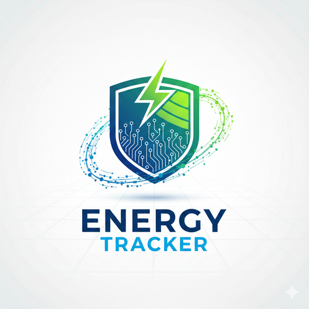

# Energy Tracker

## Team Members
[Bruce Ngere]
[Daniel Delgado]
[Tobi O'jori]
[Trevor Strother]
[Davos De Hoyos]

## What are we creating?
- We are creating a web-based dashboard application that tracks and 
  visualizes neighborhood-level energy consumption, renewable energy adoption, and sustainability trends.
- The system will allow users to: 
- Upload energy usage datasets 
- Analyze time-based consumption trends 
- Compare neighborhoods 
- Identify areas that require sustainability intervention 
- The application will transform raw energy data into meaningful visual insights.

## Who are we doing this for?
### Primary audience:
- City planners
- Municipal sustainability departments
- Urban policy makers

### Secondarily audience:
- Environmental researchers
- Community advocacy groups
- Educational institutions studying sustainability
- Local inhabitants 

## Why are we doing this?
Cities are increasingly focused on sustainability and reducing environmental impact, but decision-makers often lack clear, accessible tools to analyze localized energy data.

### Our goal is to:
- Make neighborhood energy trends easier to understand
- Support data-driven sustainability initiatives
- Help prioritize investments in renewable energy and efficiency improvements
- Encourage transparency and accountability in urban environmental planning

## General Info

## Technologies
- Tools: GitKraken, Jira, Slack, Bitbucket, VS Code
- Languages: Python, HTML, JavaScript
- Database: PostgreSQL, SQLAlchemy
- Cloud Storage: AWS S3
- Data/APIs: TBD (Focused dataset/API integration if a reliable source is found)
- Frameworks: React (frontend)
- Deployment: Docker

## Features
**Dataset Upload & Validation**  
Upload CSV/JSON energy datasets with schema validation and friendly error messages.

**Neighborhood Dashboard**  
Explore neighborhood metrics like consumption over time (kWh), renewable adoption (if available), and efficiency (e.g., kWh/household).

**Time Range Filtering**  
Filter by weekly/monthly/quarterly ranges and compare neighborhoods across the same time window.

**Hotspot Identification**  
Highlight the highest-usage neighborhoods and those with the fastest-worsening trends, with quick up/down indicators.

**Basic Reporting**  
Create summary stats (totals, averages, percent change) and export CSV/JSON or a screenshot-ready summary view.

**These features are designed for city planners and sustainability analysts reviewing neighborhood energy data.**